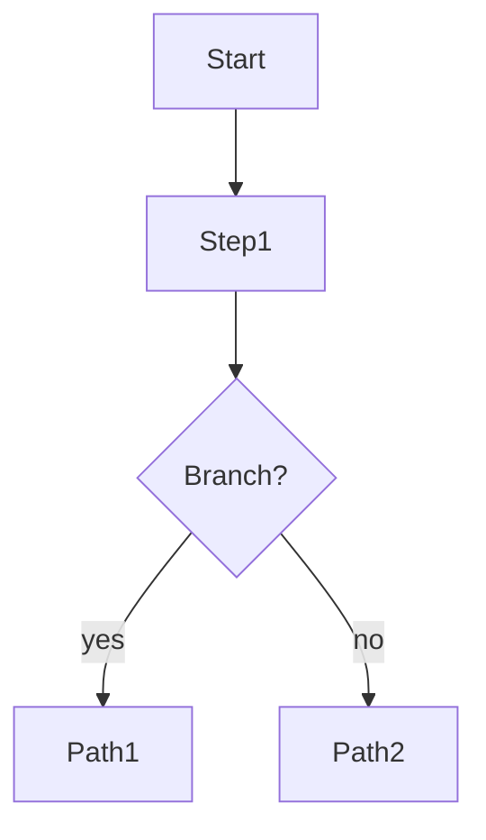

# <Discovery title>

## Problem statement

What are we solving, for whom, and why now. Keep it tight — a paragraph or two.

## Crucial points

- Bulleted list of key facts, decisions, constraints uncovered while reading source material.
- One bullet per atomic insight. If a bullet starts spanning multiple sentences, it should probably become its own section.

## Diagrams

Add one or more mermaid blocks. Common shapes: `flowchart`, `sequenceDiagram`, `stateDiagram-v2`. Drop ones you don't need.

## Tech constraints (rough, pre-discovery)

Notes that should later land in `tech-docs/tech-constraints.md`. Don't worry about polish.

- Performance / scale notes
- Security / compliance considerations
- Required integrations
- Hard dependencies

## Out of scope

Explicit non-goals. Prevents scope creep when the skill proposes improvements.

## Task breakdown

Group tasks under their parent Linear key. Multiple parent keys are allowed in one discovery. Sub-bullets become sub-items in the per-task markdown.

## <PARENT-LINEAR-KEY-1>

### Tasks

- [ ] Top-level task 1 — short imperative description
  - [ ] sub-bullet (sub-task or constraint)
  - [ ] sub-bullet
- [ ] Top-level task 2

## <PARENT-LINEAR-KEY-2>

### Tasks

- [ ] ...

## Open questions

Things still to resolve. The skill will use these to drive Gate 1's improvement proposals.
