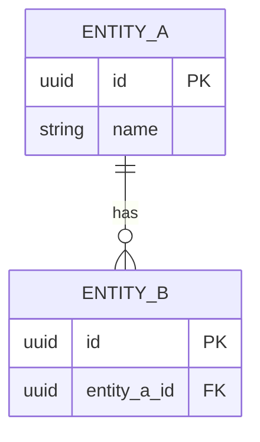

# Data model — <Discovery title>

## Notes

### New tables / columns
- ...

### Existing tables touched
- ...

### Migration considerations
- Backfill strategy
- NOT NULL columns and defaults
- Index changes
- Lock impact on hot tables
